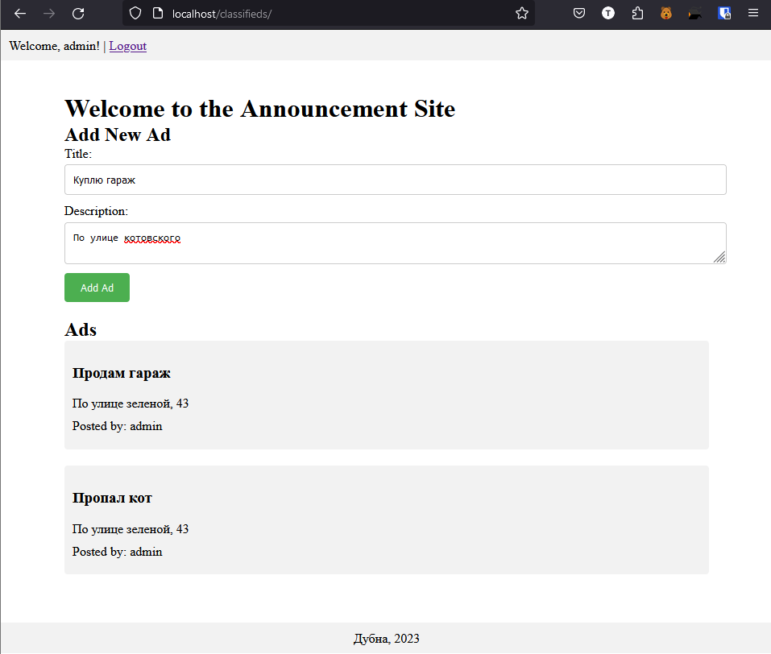

# Сайт объявлений



Это функциональный сайт объявлений, созданный с помощью PHP и XAMPP. Сайт позволяет пользователям просматривать и добавлять объявления. Добавлять объявления могут только авторизованные пользователи, а объявления публикуются без перезагрузки страницы.
## Установка

Чтобы запустить сайт объявлений локально, вам потребуется установить следующее:

- XAMPP (или любое другое локальное серверное решение, поддерживающее PHP и MySQL)
- веб-браузер

Выполните следующие шаги для установки и запуска сайта:

1. Клонируйте или загрузите репозиторий на локальную машину.
2. Запустите XAMPP и убедитесь, что службы Apache и MySQL запущены.
3. Откройте веб-браузер и перейдите по адресу `http://localhost/phpmyadmin`.
4. Создайте новую базу данных с именем `announcement_site`.
```sql
-- Create the database
CREATE DATABASE IF NOT EXISTS announcement_site;

-- Use the database
USE announcement_site;

-- Create the users table
CREATE TABLE IF NOT EXISTS users (
    id INT AUTO_INCREMENT PRIMARY KEY,
    username VARCHAR(50) NOT NULL,
    email VARCHAR(100) NOT NULL,
    password VARCHAR(255) NOT NULL
);

-- Create the ads table
CREATE TABLE IF NOT EXISTS ads (
    id INT AUTO_INCREMENT PRIMARY KEY,
    title VARCHAR(100) NOT NULL,
    description TEXT NOT NULL,
    user_id INT NOT NULL,
    FOREIGN KEY (user_id) REFERENCES users(id)
);

```
5. Скопируйте всю папку проекта в каталог XAMPP `htdocs`.
6. В веб-браузере перейдите по адресу `http://localhost/{ваш проект-папка}` для доступа к сайту.

## Использование

- Зарегистрируйте новую учетную запись пользователя или войдите в систему, используя существующие учетные данные.
- Войдя в систему, вы можете просматривать существующие объявления на главной странице.
- Чтобы добавить новое объявление, введите текст и заголовок объявления, нажмите на кнопку "Add Ad" и заполните необходимые поля.
- Вновь добавленное объявление появится на главной странице без необходимости перезагрузки страницы.


Переведено с помощью www.DeepL.com/Translator (бесплатная версия)

